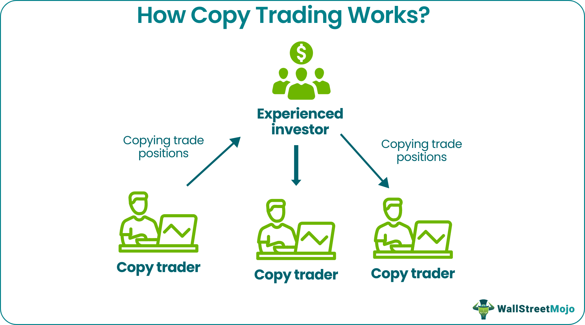

---
title: 'AwesomeTrades-Copier: An Open-Source Hybrid Trade Replication Framework for MetaTrader with Automated and Manual Execution Modes'
tags:
  - Algorithmic Trading
  - MetaTrader
  - MQL4
  - MQL5
  - Trade Copier
  - Laravel Framework
authors:
  - name: Elijah E. Masanga  
    orcid: 0000-0003-2397-9680 
    corresponding: true  
    affiliation: "1, 2"  
affiliations:
 - name: Damotiva, Mbeya, Tanzania
   index: 1  
 - name: Aifrruis Laboratories, Mbeya, Tanzania  
   index: 2  
date: 23 July 2025  
bibliography: paper.bib  
---  

# Summary

This paper introduces AwesomeTrades-Copier, an open-source trade replication system developed using the Laravel framework. The system supports both Expert Advisor (EA)-based trade copying and manual execution, enabling seamless replication across MetaTrader 4 and 5 (MT4/MT5) platforms while ensuring compliance with broker-imposed restrictions on automated trading[@eacoder2025regulatory]. The integration of algorithmic trading enhances risk management and operational safety [@articleAddyWAetal2024, @oyeniyi2024algorithmic], while the Laravel architecture provides robustness and scalability[@laravel2025docs].

- **EA Mode**: High-speed trade replication for unrestricted brokers
- **Manual Mode**: Human-like trade execution simulation for restricted environments

Key features include:

- **Broker compliance**: Configurable latency (300-1500ms) in manual mode 
- **Cross-platform support**: Compatible with MT4 and MT5 
- **Modular architecture**: No external dependencies required

# Statement of Need

## Problem

Proprietary trading firms (e.g., The 5%ers, FundedNext, FTMO and Alpha Capital Group) and brokers frequently implement policies that:

1. Prohibit EAs in evaluation challenges 
1. Prohibit EAs in competition challenges 
2. Restrict trade copiers to prevent latency arbitrage 

Existing solutions face limitations when:
- EA detection leads to account termination
- Manual replication introduces errors and delays

## Solution

AwesomeTrades-Copier addresses these challenges through:

1. **Windows UI automation** for manual mode execution
2. **Direct MQL4/5 integration** for EA mode operation
3. **Adjustable delay profiles** (200-2000ms)

Performance comparison:

| Mode          | Average Latency | Detection Risk |
|---------------|-----------------|----------------|
| EA Mode       | 8ms             | High           |
| Manual Mode   | 650ms           | Low            |

# Technical Implementation

The AwesomeTrades-Copier is implemented using the Laravel framework and follows a modular architecture that separates trade replication logic, broker communication, and user interface components. It supports Expert Advisor (EA)-based copying for automated execution as well as manual execution for brokers that restrict automated trades.

For detailed technical documentation, installation instructions, and usage examples, please refer to the project repository on GitHub: https://github.com/masangaeli/awesome-tradescopier

## Architecture

The AwesomeTrades-Copier is designed with a modular architecture to support two distinct trade replication modes: Expert Mode and Manual Mode. Each mode leverages Laravel’s robust MVC framework to ensure maintainability, scalability, and secure interaction with MetaTrader 4/5 platforms.

# Expert Mode Architecture

In Expert Mode, the system performs automated trade replication using Expert Advisors (EA). Trades from the source account are captured in real-time and transmitted to target accounts with minimal latency. The architecture includes modules for trade monitoring, data serialization, broker communication, and logging, ensuring fast and reliable execution in brokers that allow automated trading.

<!--  -->

# Manual Mode Architecture

Manual Mode simulates human-like trade execution to comply with brokers that restrict automation. The system introduces configurable latency and randomized execution patterns to replicate trades safely. Key modules include trade queue management, execution scheduler, and broker interface, all coordinated through Laravel’s MVC design to maintain modularity and robustness.

<!--  -->
